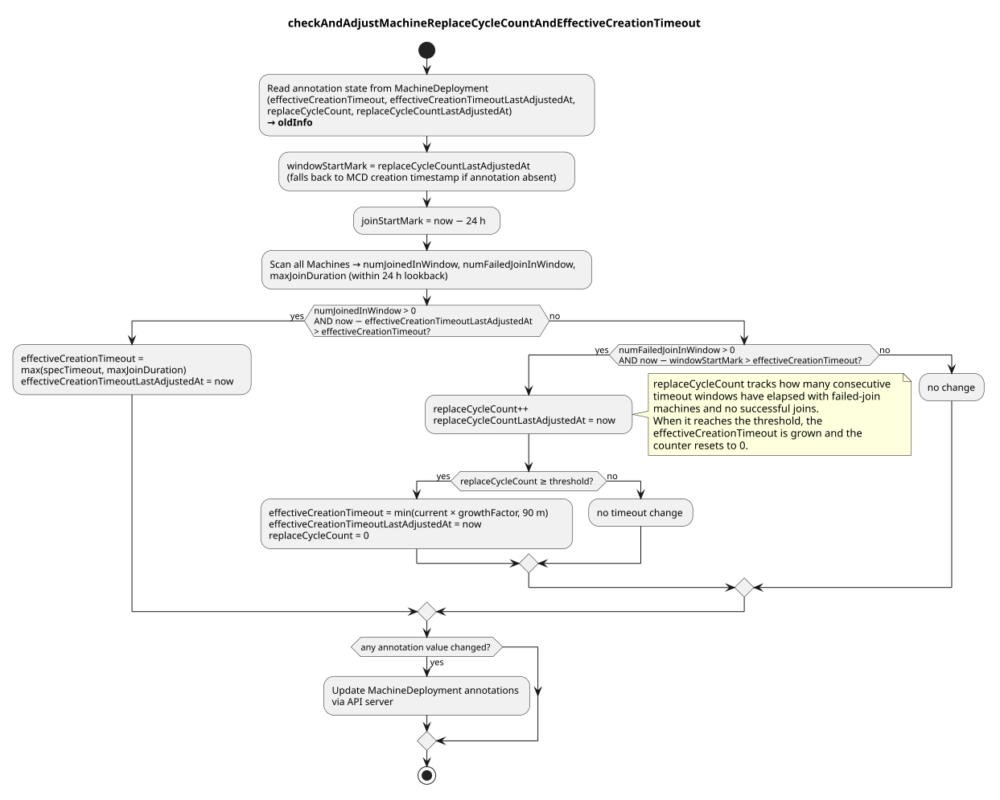

# Machine Deployment Effective Creation Timeout

## Background

MCM uses a `machineCreationTimeout` to detect machines that are stuck during provisioning. A fixed timeout works well under normal conditions, but is fragile otherwise:

- **Too short**: legitimate slow-provision environments (e.g. busy cloud AZs, large images) cause healthy machines to be marked failed and replaced unnecessarily, creating a churn loop.
- **Too long**: a timeout that is padded for slow environments causes auto-scaling scaledown by increasing the time taken for the `cluster-autoscaler` to put the `NodeGroup` of the `MachineDeployment` into backoff.

The problem is that a single static value cannot adapt to observed provisioning behaviour.

## Design

MCM automatically maintains an `effective-creation-timeout` annotation on each `MachineDeployment`. 
The effective timeout starts at the `MachineDeployment` configured (or default) value and is adjusted up or down by the MCM controller based on observed machine join behaviour.

When a new `Machine` is created, the `effective-creation-timeout` annotation is propagated from the `MachineDeployment` onto the `Machine` object (via `getMachinesAnnotationSet` in the MachineSet controller, [#1104](https://github.com/gardener/machine-controller-manager/pull/1104)). The machine controller reads this annotation to determine how long a `Pending` machine has before it is transitioned to the `Failed` phase and subsequently replaced. Specifically:

- A machine that remains `Pending` beyond the effective timeout is moved to `Failed` (rather than `CrashLoopBackOff`), triggering replacement by the MachineSet controller.
- The bootstrap token issued at machine creation is also scoped to expire at `creationTime + effectiveCreationTimeout`.

### Annotations

All state is stored as annotations on the `MachineDeployment`:

| Annotation | Description |
|---|---|
| `node.machine.sapcloud.io/effective-creation-timeout` | Current effective timeout. Overrides `spec.machineCreationTimeout` when present. |
| `node.machine.sapcloud.io/effective-creation-timeout-last-adjusted-at` | Timestamp of the last adjustment. Used as a cooldown guard. |
| `node.machine.sapcloud.io/replace-cycle-count` | Number of consecutive failure cycles (machines failing to join within the effective-creation-timeout with no successful joins) since the last timeout adjustment. Resets to 0 when the threshold is breached and the timeout is grown. |
| `node.machine.sapcloud.io/replace-cycle-count-last-adjusted-at` | Timestamp of the last replace-cycle-count increment. Defines the start of the current failure window. |

### Adjustment logic

On every `MachineDeployment` reconcile, MCM evaluates two time windows:

- **Failure window** (`windowStartMark`): from `replace-cycle-count-last-adjusted-at` (falls back to the MCD creation timestamp on first reconcile) to now. Counts machines that received a `FailedJoin` condition within this window.
  - A new `NodeConditionType` type `MachineFailed` maintained in `Machine.Status.Conditions` was introduced to assist here.
- **Join lookback** (`joinStartMark`): a fixed 24-hour trailing window. Measures the maximum observed join duration (`maxJoinDuration`) across successfully joined machines.
  - A new `NodeConditionType` type `MachineJoined` maintained in `Machine.Status.Conditions` was introduced to assist here.

Three outcomes are possible for each reconcile of the `MachineDeployment` within the new `checkAndAdjustMachineReplaceCycleCountAndEffectiveCreationTimeout` :

**1. Machines are failing repeatedly (timeout growth)**

If no machines have joined but failures are present, and the failure window has been open longer than the current effective timeout, the `replaceCycleCount` is incremented. When the count reaches the configured threshold (`MachineReplaceCycleCountThreshold`, default 2), the timeout is grown:

```
effectiveCreationTimeout = min(current × DefaultCreationTimeoutGrowthFactor, DefaultCreationTimeoutMax)
replaceCycleCount reset to 0
```

The growth factor is `DefaultCreationTimeoutGrowthFactor` (2) and the ceiling is `DefaultCreationTimeoutMax` (90 minutes).

**2. Machines joined successfully (timeout reduction)**

If machines joined within the lookback window and the cooldown since the last adjustment has elapsed, the effective timeout is reduced to reflect actual observed behaviour:

```
effectiveCreationTimeout = max(specTimeout, maxJoinDuration)
```

This prevents the timeout from drifting below the spec value while allowing it to track real join durations.

**3. No signal** => no change is made.

The activity diagram below illustrates the full decision flow:



### Defaults

| Parameter | Default |
|---|---|
| Initial effective timeout | `spec.machineCreationTimeout` or 20 minutes |
| Growth factor | `DefaultCreationTimeoutGrowthFactor` (2×) |
| Maximum effective timeout | `DefaultCreationTimeoutMax` (90 minutes) |
| Replace-cycle threshold | 2 (`MachineReplaceCycleCountThreshold`, CLI: `--machine-replace-cycle-count-threshold`) |
| Join duration lookback | 24 hours |
