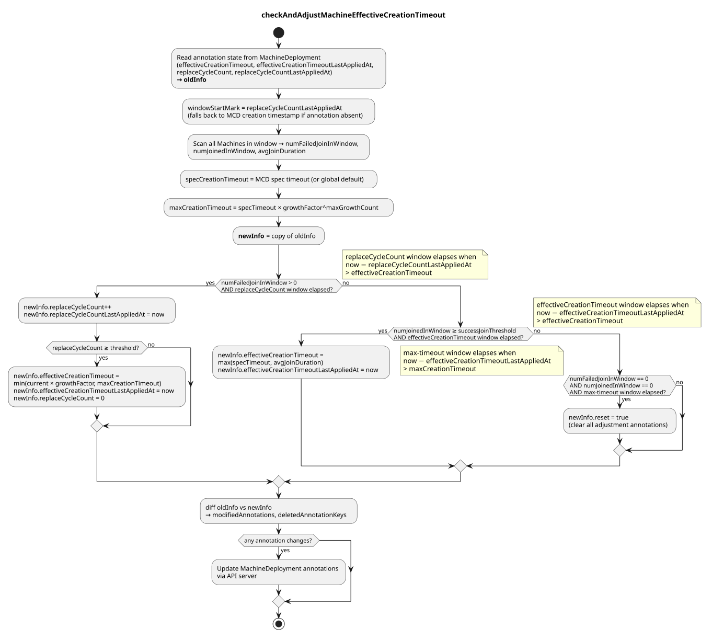

# Machine Deployment Effective Creation Timeout

## Background

MCM uses a `machineCreationTimeout` to detect machines that are stuck during provisioning. A fixed timeout works well under normal conditions, but is fragile otherwise:

- **Too short**: legitimate slow-provision environments (e.g. busy cloud AZs, large images) cause healthy machines to be marked failed and replaced unnecessarily, creating a churn loop.
- **Too long**: a timeout that is padded for slow environments increases the time taken by the `cluster-autoscaler` to put the `NodeGroup` of the `MachineDeployment` into backoff.

The problem is that a single static value cannot adapt to observed provisioning behaviour.

## Design

MCM automatically maintains an `effective-creation-timeout` annotation on each `MachineDeployment`.
The effective timeout starts at the `MachineDeployment` configured spec value (or global default) and is adjusted up or down by the MCM controller based on observed machine join behaviour.

When a new `Machine` is created, the `effective-creation-timeout` annotation is propagated from the `MachineDeployment` onto the `Machine` object (via `getMachinesAnnotationSet` in the MachineSet controller, [#1104](https://github.com/gardener/machine-controller-manager/pull/1104)). The machine controller reads this annotation to determine how long a `Pending` machine has before it is transitioned to the `Failed` phase and subsequently replaced. Specifically:

- A machine that remains `Pending` beyond the effective timeout is moved to `Failed` (rather than `CrashLoopBackOff`), triggering replacement by the MachineSet controller.
- The bootstrap token issued at machine creation is also scoped to expire at `creationTime + effectiveCreationTimeout`.

### Annotations

All state is stored as annotations on the `MachineDeployment`:

| Annotation | Description |
|---|---|
| `node.machine.sapcloud.io/effective-creation-timeout` | Current effective timeout. Overrides `spec.machineCreationTimeout` when present. |
| `node.machine.sapcloud.io/effective-creation-timeout-last-applied-at` | Timestamp of the last adjustment to the effective timeout. Used as a cooldown guard for the shrink branch. |
| `node.machine.sapcloud.io/replace-cycle-count` | Number of failure cycles accumulated since the last timeout growth. Resets to 0 when the threshold is breached and the timeout is grown. |
| `node.machine.sapcloud.io/replace-cycle-count-last-applied-at` | Timestamp of the last replace-cycle-count increment. Defines the start of the current failure window. Falls back to the MCD creation timestamp on first reconcile. |

Join and failure activity is detected via `Machine.Status.Conditions`:

- A `MachineJoined` condition (`Status=True`) is set when a machine's node successfully registers with the cluster.
- A `MachineJoined` condition (`Status=False`, `Reason=FailedJoin`) is set when a machine fails to join within the effective creation timeout.

### Adjustment logic

On every `MachineDeployment` reconcile, `checkAndAdjustMachineEffectiveCreationTimeout` scans all machines belonging to the MachineDeployment and counts, within the current failure window (`windowStartMark = replaceCycleCountLastAppliedAt`):

- `numFailedJoinInWindow`: machines with a `FailedJoin` condition transition after `windowStartMark`
- `numJoinedInWindow`: machines with a successful `MachineJoined` condition transition after `windowStartMark`
- `avgJoinDuration`: average observed join duration across in-window joiners

Four outcomes are possible for each reconcile:

**1. Machines are failing repeatedly (timeout growth)**

If failures are present in the window and the failure window has been open longer than the current effective timeout, the `replaceCycleCount` is incremented. When the count reaches the configured threshold (`MachineReplaceCycleCountThreshold`, default `2`), the timeout is grown:

```
effectiveCreationTimeout = min(current × growthFactor, maxCreationTimeout)
replaceCycleCount reset to 0
```

where `growthFactor = 1 + creationTimeoutGrowthPercent / 100` (default `1.5`) and `maxCreationTimeout = specTimeout × growthFactor^maxGrowthCount` (default `specTimeout × 1.5^4`).

The cycle count resets to 0 after each growth step, so the threshold must be breached again before the next growth step occurs.

**2. Machines joined successfully (timeout shrink)**

If at least `successJoinThreshold` (default `2`) machines joined within the window and the cooldown since the last timeout adjustment has elapsed (i.e. one full `effectiveCreationTimeout` duration), the effective timeout is reduced to reflect actual observed behaviour:

```
effectiveCreationTimeout = max(specTimeout, avgJoinDuration)
```

This prevents the timeout from drifting below the spec value while allowing it to track real join durations.

**3. Idle reset**

If no machines have joined or failed for a full `maxCreationTimeout` duration since the last timeout adjustment, all adjustment annotations are cleared. This resets the effective timeout back to the spec value for a `MachineDeployment` that has been idle (e.g. scaling completed), avoiding a stale grown timeout affecting future scale-outs.


### Activity Diagram

The activity diagram below illustrates the full decision flow:



### Configuration

Both the growth percent and the replace-cycle-count threshold can be configured globally via CLI flags and overridden per `MachineDeployment` via `.spec.template.spec.machineConfiguration`:

| Parameter | CLI flag | `MachineConfiguration` field | Default |
|---|---|---|---|
| Growth percent per step | `--machine-creation-timeout-growth-percent` | `creationTimeoutGrowthPercent` | `50` (i.e. 1.5× factor) |
| Replace-cycle count threshold | `--machine-replace-cycle-count-threshold` | `replaceCycleCountThreshold` | `2` |

### Defaults

| Parameter | Default |
|---|---|
| Initial effective timeout | `spec.machineCreationTimeout` or `20m` |
| Growth percent per step | `50%` (1.5× factor, CLI: `--machine-creation-timeout-growth-percent`) |
| Maximum growth steps | `4` (`DefaultMaxCreationTimeoutGrowthCount`) |
| Maximum effective timeout | `specTimeout × 1.5^4` ≈ `5× specTimeout` |
| Replace-cycle count threshold | `2` (CLI: `--machine-replace-cycle-count-threshold`) |
| Successful join threshold for shrink | `2` (`DefaultSuccessJoinCountThreshold`) |
