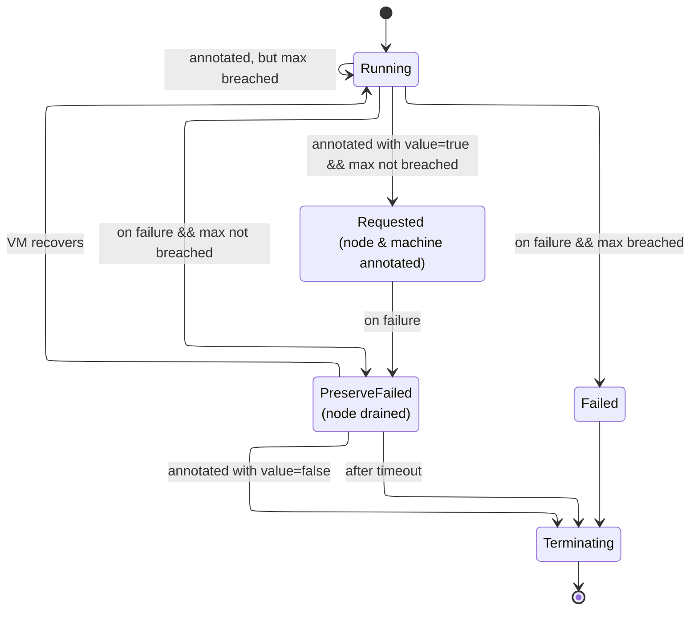

# Preservation of Failed Machines

<!-- TOC -->

- [Preservation of Failed Machines](#preservation-of-failed-machines)
    - [Objective](#objective)
    - [Proposal](#proposal)
    - [State Machine](#state-machine)
    - [Use Cases](#use-cases)

<!-- /TOC -->

## Objective

Currently, the Machine Controller Manager(MCM) moves Machines with errors to the `Unknown` phase, and after the configured `machineHealthTimeout`, to the `Failed` phase.
`Failed` machines are swiftly moved to the `Terminating` phase during which the node is drained and the `Machine` object is deleted. This rapid cleanup prevents SRE/operators/support from conducting an analysis on the VM and makes finding root cause of failure more difficult.

This document proposes enhancing MCM, such that:
* VMs of `Failed` machines are retained temporarily for analysis
* There is a configurable limit to the number of `Failed` machines that can be preserved
* There is a configurable limit to the duration for which such machines are preserved
* Users can specify which healthy machines they would like to preserve in case of failure 
* Users can request MCM to release a preserved `Failed` machine, even before the timeout expires, so that MCM can transition the machine to `Terminating` phase and trigger its deletion.

## Proposal

In order to achieve the objectives mentioned, the following are proposed:
1. Enhance `machineControllerManager` configuration in the `ShootSpec`, to specify the max number of failed machines to be preserved,
and the time duration for which these machines will be preserved.
    ```
    machineControllerManager:
       failedMachinePreserveMax: 2
       failedMachinePreserveTimeout: 3h
    ```
    * Since gardener worker pool can correspond to `1..N` MachineDeployments depending on number of zones, `failedMachinePreserveMax` will be distributed across N machine deployments.
    * `failedMachinePreserveMax` must be chosen such that it can be appropriately distributed across the MachineDeployments.
2. Allow user/operator to explicitly request for preservation of a specific machine with the use of an annotation : `node.machine.sapcloud.io/preserve-when-failed=true`, such that, if it moves to `Failed` phase, the machine is preserved by MCM, provided there is capacity.
3. MCM will be modified to introduce a new stage in the `Failed` phase: `machineutils.PreserveFailed`, and a failed machine that is preserved by MCM will be transitioned to this stage after moving to `Failed`.
4. A machine in `PreserveFailed` stage automatically moves to `Terminating` phase once `failedMachinePreserveTimeout` expires. 
   * A user/operator can request MCM to stop preserving a machine in `PreservedFailed` stage using the annotation: `node.machine.sapcloud.io/preserve-when-failed=false`. 
   * For a machine thus annotated, MCM will move it to `Terminating` phase even if `failedMachinePreserveTimeout` has not expired.
5. If an un-annotated machine moves to `Failed` phase, and the `failedMachinePreserveMax` has not been reached, MCM will auto-preserve this machine.
6. Machines of a MachineDeployment in `PreserveFailed` stage will also be counted towards the replica count and the enforcement of maximum machines allowed for the MachineDeployment.
7. At any point in time `machines requested for preservation + machines in PreservedFailed <= failedMachinePreserveMax`. If  `machines requested for preservation + machines in PreservedFailed` is at or exceeds `failedMachinePreserveMax` on annotating a machine, the annotation will be deleted by MCM. 


## State Machine

The behaviour described above can be summarised using the state machine below:


In the above state machine, the phase `Running` also includes machines that are in the process of creation for which no errors have been encountered yet.

## Use Cases:

### Use Case 1: Proactive Preservation Request
**Scenario:** Operator suspects a machine might fail and wants to ensure preservation for analysis.
#### Steps:
1. Operator annotates node with `node.machine.sapcloud.io/preserve-when-failed=true`, provided `failedMachinePreserveMax` is not violated
2. Machine fails later
3. MCM preserves the machine
4. Operator analyzes the failed VM

### Use Case 2: Automatic Preservation
**Scenario:** Machine fails unexpectedly, no prior annotation.
#### Steps:
1. Machine transitions to `Failed` phase
2. If `failedMachinePreserveMax` is not breached, machine moved to `PreserveFailed` phase by MCM
3. After `failedMachinePreserveTimeout`, machine is terminated by MCM

### Use Case 3: Capacity Management
**Scenario:** Multiple machines fail when preservation capacity is full.
#### Steps:
1. Machines M1, M2 already preserved (failedMachinePreserveMax = 2)
2. Operator wishes to preserve M3 in case of failure. He increases `failedMachinePreserveMax` to 3, and annotates M3 with `node.machine.sapcloud.io/preserve-when-failed=true`.
3. If M3 fails, machine moved to `PreserveFailed` phase by MCM.

### Use Case 4: Early Release
**Scenario:** Operator has performed his analysis and no longer requires machine to be preserved

#### Steps:
1. Machine M1 is in `PreserveFailed` phase
2. Operator adds: `node.machine.sapcloud.io/preserve-when-failed=false` to node.
3. MCM transitions M1 to `Terminating` even though `failedMachinePreserveTimeout` has not expired
4. Capacity becomes available for preserving future `Failed` machines.

## Open Point

How will MCM provide the user with the option to drain a node when it is in `PreserveFailed` stage?

## Limitations

1. During rolling updates we will NOT honor preserving Machines. The Machine will be replaced with a healthy one if it moves to Failed phase.
2. Since gardener worker pool can correspond to 1..N MachineDeployments depending on number of zones, we will need to distribute the `failedMachinePreserveMax` across N machine deployments.
So, even if there are no failed machines preserved in other zones, the max per zone would still be enforced. Hence, the value of `failedMachinePreserveMax` should be chosen appropriately. 
