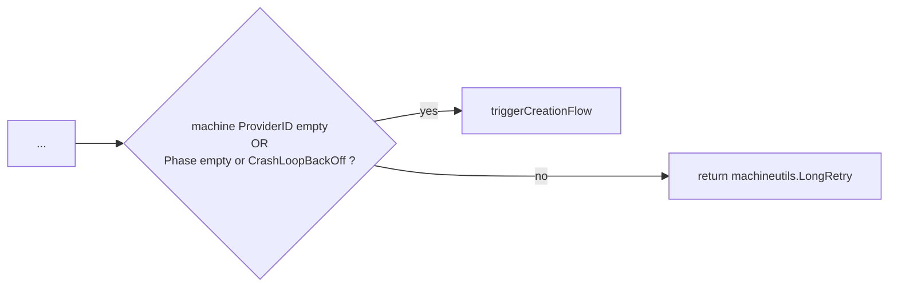
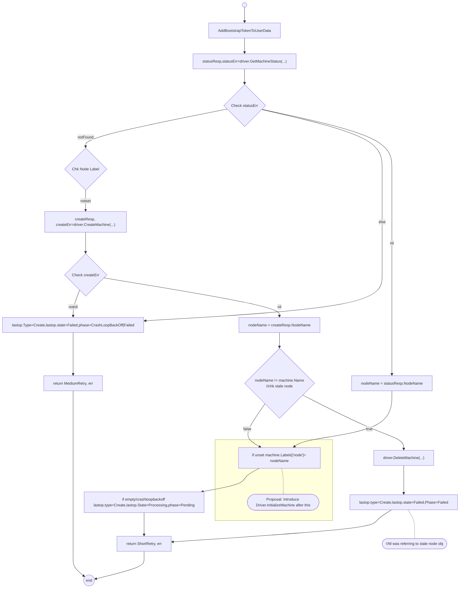

# Post-Create Initialization of Machine Instance

## Background

Today the [driver.Driver](https://github.com/gardener/machine-controller-manager/blob/rel-v0.49/pkg/util/provider/driver/driver.go#L28) facade represents the boundary between the the `machine-controller` and its various provider specific implementations.

We have abstract operations for creation/deletion and listing of machines (actually compute instances) but we do not correctly handle post-creation initialization logic. Nor do we provide an  abstract operation to represent the hot update of an instance after creation.

We have found this to be necessary for several use cases. Today in the MCM AWS Provider, we already misuse `driver.GetMachineStatus`  which is supposed to be a read-only operation obtaining the status of an instance. 

1. Each AWS EC2 instance performs source/destination checks by default.
For [EC2 NAT](https://docs.aws.amazon.com/vpc/latest/userguide/VPC_NAT_Instance.html#EIP_Disable_SrcDestCheck) instances
these should be disabled. This is done by issuing
a [ModifyInstanceAttribute](https://docs.aws.amazon.com/AWSEC2/latest/APIReference/API_ModifyInstanceAttribute.html) request with the `SourceDestCheck` set to `false`. The MCM AWS Provider, decodes the  [AWSProviderSpec](https://github.com/gardener/machine-controller-manager-provider-aws/blob/39318bb2b5b4a573fdc77eaf400839d12c4abf59/pkg/aws/apis/aws_provider_spec.go#L63), reads `providerSpec.SrcAndDstChecksEnabled` and correspondingly issues the call to modify the already launched instance. However, this should be done as an action after creating the instance and should not be part of the VM status retrieval.

2. Similarly, there is a [pending PR](https://github.com/gardener/machine-controller-manager-provider-aws/pull/128) to add the `Ipv6AddessCount` and `Ipv6PrefixCount` to enable the assignment of an ipv6 address and an ipv6 prefix to instances. This requires constructing and issuing an [AssignIpv6Addresses](https://docs.aws.amazon.com/AWSEC2/latest/APIReference/API_AssignIpv6Addresses.html) request after the EC2 instance is available. 

3. We have other uses-cases such as  [MCM Issue#750](https://github.com/gardener/machine-controller-manager/issues/750) where there is a requirement to provide a way for consumers to add tags which can be hot-updated onto instances. This requirement can be generalized to also offer a convenient way to specify tags which can be applied to VMs, NICs, Devices etc.

4. We have a need for "machine-instance-not-ready" taint as described in [MCM#740](https://github.com/gardener/machine-controller-manager/issues/740) which should only get removed once the post creation updates are finished.


## Objectives

We will split the fulfilment of this overall need into 2 stages of implementation.

1. **Stage-A**: Support post-VM creation initialization logic of the instance suing a proposed `Driver.InitializeMachine` by permitting provider implementors to add initialization logic after VM creation, return with special new error code `codes.Initialization` for initialization errors and correspondingly support a new machine operation stage `InstanceInitialization` which will be updated in the machine `LastOperation`. The [triggerCreationFlow](https://github.com/gardener/machine-controller-manager/blob/rel-v0.50/pkg/util/provider/machinecontroller/machine.go#L310) - a reconciliation sub-flow of the MCM responsible for orchestrating instance creation and updating machine status will be changed to support this behaviour.


2. **Stage-B**: Introduction of `Driver.UpdateMachine` and enhancing the MCM, MCM providers and gardener extension providers to support hot update of instances through `Driver.UpdateMachine`.  The MCM [triggerUpdationFlow](https://github.com/gardener/machine-controller-manager/blob/v0.50.1/pkg/util/provider/machinecontroller/machine.go#L531) - a reconciliation sub-flow of the MCM which is supposed to be responsible for orchestrating instance update - but currently not used, will be updated to invoke the provider `Driver.UpdateMachine` on hot-updates to to the `Machine` object

## Stage-A Proposal


### Instance Not Ready Taint 

- Due to the fact that creation flow for machines will now be enhanced to correctly support post-creation startup logic, we should not scheduled workload until this startup logic is complete.  Even without this feature we have a need for such a taint as described in [MCM#740](https://github.com/gardener/machine-controller-manager/issues/740)
- We propose a new taint `node.machine.sapcloud.io/instance-not-ready` which  will be added as a node startup taint in gardener core [KubeletConfiguration.RegisterWithTaints](https://github.com/gardener/gardener/blob/v1.83.1/pkg/component/extensions/operatingsystemconfig/original/components/kubelet/config.go#L101)
- The will will then removed by MCM in health check reconciliation, once the machine becomes fully ready. (when moving to `Running` phase)
- We will add this taint as part of `--ignore-taint` in CA
- We will introduce a disclaimer / prerequisite in the MCM FAQ, to add this taint as part of kubelet config under `--register-with-taints`, otherwise workload could get scheduled , before machine beomes `Running`


### Current MCM triggerCreationFlow

Today, [reconcileClusterMachine](https://github.com/gardener/machine-controller-manager/blob/v0.50.1/pkg/util/provider/machinecontroller/machine.go#L89) which is the main routine for the `Machine` object reconciliation invokes  [triggerCreationFlow](https://github.com/gardener/machine-controller-manager/blob/rel-v0.50/pkg/util/provider/machinecontroller/machine.go#L310) at the end when the `machine.Spec.ProviderID` is empty or if the `machine.Status.CurrentStatus.Phase` is empty or in `CrashLoopBackOff`



Today, the `triggerCreationFlow` is illustrated below with some minor details omitted/compressed for brevity 

*NOTES*
* The `lastop` below is an abbreviation for `machine.Status.LastOperation`. This, along with the machine phase is generally updated on the `Machine` object just before returning from the method.
* regarding `phase=CrashLoopBackOff|Failed`. the machine phase may either be `CrashLoopBackOff` or move to `Failed` if the difference between current time  and the `machine.CreationTimestamp` has exceeded the configured `MachineCreationTimeout`.
 



### Enhancement of MCM triggerCreationFlow

#### Relevant Observations on Current Flow
1. Observe that we always perform a call to `Driver.GetMachineStatus` and only then conditionally perform a call to `Driver.CreateMachine` if there was was no machine found.
1. Observe that after the call to a successful `Driver.CreateMachine`, the machine phase is set to `Pending`, the `LastOperation.Type` is currently set to `Create` and the `LastOperation.State` set to `Processing` before returning with a `ShortRetry`. The `LastOperation.Description` is (unfortunately) set to the fixed message: `Creating machine on cloud provider`.
1. Observe that after an erroneous call to `Driver.CreateMachine`, the machine phase is set to `CrashLoopBackOff` or `Failed`  (in case of creation timeout).

The following changes are proposed with a view towards minimal impact on current code and no introduction of a new Machine Phase. 

#### MCM Changes
1. We propose introducing a new machine operation `Driver.InitializeMachine` with the following signature
    ```go
    type Driver interface {
        // .. existing methods are omitted for brevity.

        // InitializeMachine call is responsible for post-create initialization of the provider instance.
        InitializeMachine(context.Context, *InitializeMachineRequest) error
    }

    // InitializeMachineRequest is the initialization request for machine instance initialization
    type InitializeMachineRequest struct {
        // Machine object whose VM instance should be initialized 
        Machine *v1alpha1.Machine

        // MachineClass backing the machine object
        MachineClass *v1alpha1.MachineClass

        // Secret backing the machineClass object
        Secret *corev1.Secret

    }
    ```
1. We propose introducing a new MC error code `codes.Initialization` indicating that the VM Instance was created but there was an error in initialization after VM creation. The implementor of `Driver.InitializeMachine` can return this error code, indicating that `InitializeMachine` needs to be called again. The Machine Controller will change the phase to `CrashLoopBackOff` as usual when encountering a `codes.Initialization` error. 
1. We will introduce a new _machine operation_ stage `InstanceInitialization`. In case of an `codes.Initialization` error 
   1. the `machine.Status.LastOperation.Description` will be set to `InstanceInitialization`, 
   1. `machine.Status.LastOperation.ErrorCode` will be set to `codes.Initialization`
   1. the `LastOperation.Type` will be set to `Create` 
   1. the `LastOperation.State` set to `Failed` before returning with a `ShortRetry`
1. The semantics of `Driver.GetMachineStatus` will be changed. If the instance associated with machine exists, but the instance was not initialized as expected, the provider implementations of `GetMachineStatus` should return an error:  `status.Error(codes.Initialization)`.
1. If `Driver.GetMachineStatus` returned an error encapsulating `codes.Initialization` then `Driver.InitializeMachine` will be invoked again in the `triggerCreationFlow`. 
1. As according to the usual logic, the main machine controller reconciliation loop will now re-invoke the `triggerCreationFlow` again if the machine phase is `CrashLoopBackOff`. 

#### Illustration



#### AWS Provider Changes 

##### Driver.InitializeMachine

The implementation for the AWS Provider will look something like:
1. After the VM instance is available, check `providerSpec.SrcAndDstChecksEnabled`, construct `ModifyInstanceAttributeInput` and call `ModifyInstanceAttribute`. In case of an error return `codes.Initialization` instead of the current `codes.Internal`
1. Check `providerSpec.NetworkInterfaces` and if `Ipv6PrefixCount` is not `nil`, then construct `AssignIpv6AddressesInput` and call `AssignIpv6Addresses`. In case of an error return `codes.Initialization`. Don't use the generic `codes.Internal`

The [existing Ipv6 PR](https://github.com/gardener/machine-controller-manager-provider-aws/pull/128) will need modifications.

##### Driver.GetMachineStatus

1. If `providerSpec.SrcAndDstChecksEnabled` is `false`, check `ec2.Instance.SourceDestCheck`. If it does not match then return `status.Error(codes.Initialization)`
1. Check `providerSpec.NetworkInterfaces` and if `Ipv6PrefixCount` is not `nil`, check `ec2.Instance.NetworkInterfaces` and check if `InstanceNetworkInterface.Ipv6Addresses` has a non-nil slice. If this is not the case then return `status.Error(codes.Initialization)`


## Stage-B Proposal

### Enhancement of Driver Interface

We propose the following signature for the new `UpdateMachine` method.
```go
type Driver interface {
    // .. existing methods are omitted for brevity.

    // UpdateMachine call is responsible for updation of provider instance using the data in the given UpdateMachineRequest.
    UpdateMachine(context.Context, *UpdateMachineRequest) error
}

// UpdateMachineRequest is the request encapsulating identification and updation data regarding instance configuration. 
type UpdateMachineRequest struct {
    ProviderID string
    LastAppliedProviderSpec raw.Extension
    MachineClass *v1alpha1.MachineClass
    Secret *corev1.Secret
}
```
Kindly refer to the [Hot-Update Instances](./hotupdate-instances.md) design which provides elaborate detail.