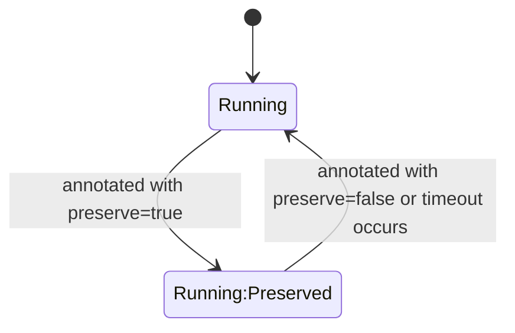
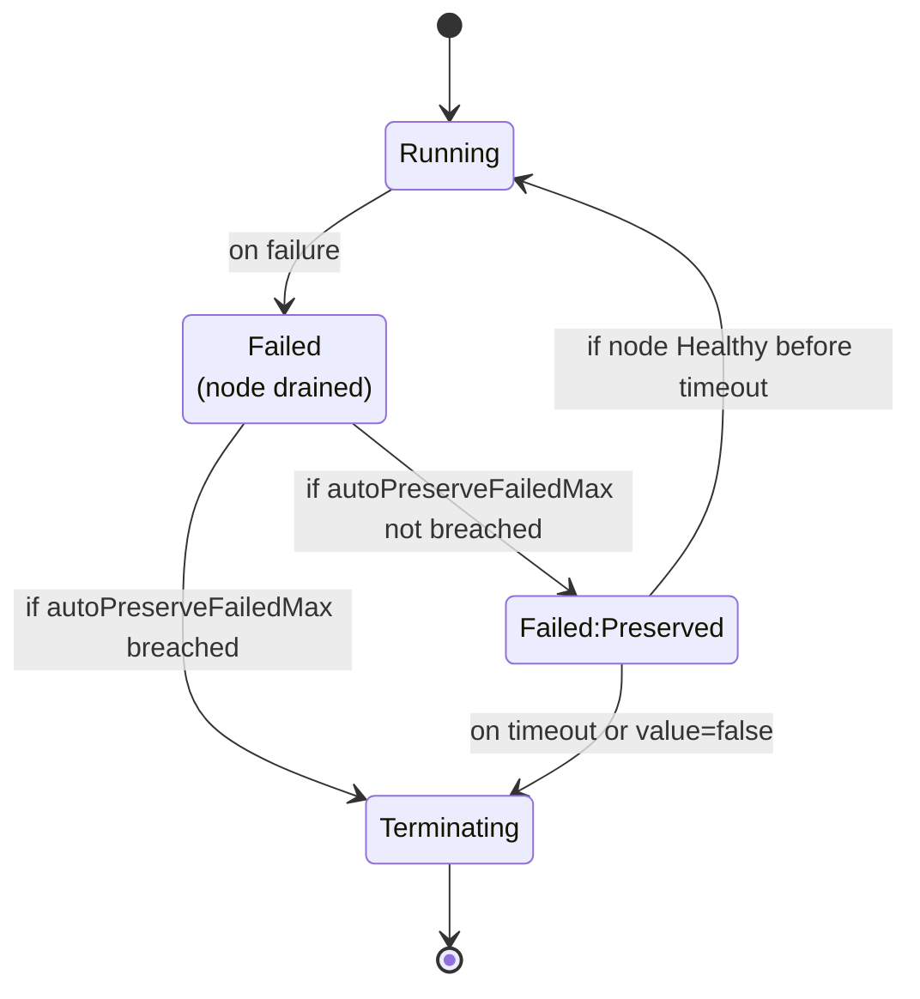

# Preservation of Machines

<!-- TOC -->

- [Preservation of Machines](#preservation-of-machines)
    - [Objective](#objective)
    - [Proposal](#proposal)
    - [State Diagrams](#state-diagrams)
    - [Use Cases](#use-cases)

<!-- /TOC -->

## Objective

Currently, the Machine Controller Manager(MCM) moves Machines with errors to the `Unknown` phase, and after the configured `machineHealthTimeout`, to the `Failed` phase.
`Failed` machines are swiftly moved to the `Terminating` phase during which the node is drained and the `Machine` object is deleted. This rapid cleanup prevents SRE/operators/support from conducting an analysis on the VM and makes finding root cause of failure more difficult.

Moreover, in cases where a node seems healthy but all the workload on it are facing issues, there is a need for operators to be able to cordon/drain the node and conduct their analysis without the cluster-autoscaler (CA) scaling down the node.

This document proposes enhancing MCM, such that:
* VMs of machines are retained temporarily for analysis
* There is a configurable limit to the number of machines that can be preserved automatically on failure (auto-preservation)
* There is a configurable limit to the duration for which machines are preserved
* Users can specify which healthy machines they would like to preserve in case of failure, or for diagnoses in current state (prevent scale down by CA) 
* Users can request MCM to release a preserved machine, even before the timeout expires, so that MCM can transition the machine to either `Running` or `Terminating` phase, as the case may be.

Related Issue: https://github.com/gardener/machine-controller-manager/issues/1008

## Proposal

In order to achieve the objectives mentioned, the following are proposed:
1. Enhance `machineControllerManager` configuration in the `ShootSpec`, to specify the max number of machines to be auto-preserved,
and the time duration for which these machines will be preserved.
    ```
    machineControllerManager:
       autoPreserveFailedMax: 0
       machinePreserveTimeout: 72h
    ```
    * This configuration will be set per worker pool.
    * Since gardener worker pool can correspond to `1..N` MachineDeployments depending on number of zones, `machinePreserveMax` will be distributed across N machine deployments.
    * `machinePreserveMax` must be chosen such that it can be appropriately distributed across the MachineDeployments.
    * Example: if `machinePreserveMax` is set to 2, and the worker pool has 2 zones, then the maximum number of machines that will be preserved per zone is 1.
2. MCM will be modified to include a new sub-phase `Preserved` to indicate that the machine has been preserved by MCM.
3. Allow user/operator to request for preservation of a specific machine/node with the use of annotation : `node.machine.sapcloud.io/preserve=true`.
4. When annotation `node.machine.sapcloud.io/preserve=true` is added to a `Running` machine, the following will take place:
   - `cluster-autoscaler.kubernetes.io/scale-down-disabled: "true"` is added to the node to prevent CA from scaling it down.
   - `machine.CurrentStatus.PreserveExpiryTime` is updated by MCM as $machine.CurrentStatus.PreserveExpiryTime = currentTime+machinePreserveTimeout$
   - The machine's phase is changed to `Running:Preserved`
   - After timeout, the `node.machine.sapcloud.io/preserve=true` and `cluster-autoscaler.kubernetes.io/scale-down-disabled: "true"` are deleted, the machine phase is changed to `Running` and the CA may delete the node. The `machine.CurrentStatus.PreserveExpiryTime` is set to `nil`.
5. When an un-annotated machine goes to `Failed` phase and `autoPreserveFailedMax` is not breached:
   - Pods (other than DaemonSet pods) are drained.
   - The machine's phase is changed to `Failed:Preserved`.
   - `machine.CurrentStatus.PreserveExpiryTime` is updated by MCM as $machine.CurrentStatus.PreserveExpiryTime = currentTime+machinePreserveTimeout$
   - After timeout, the phase is changed to `Terminating`.
   - Number of machines in `Failed:Preserved` phase count towards enforcing `autoPreserveFailedMax`.
6. If a failed machine is currently in `Failed:Preserved` and after timeout its VM/node is found to be Healthy, the machine will be moved to `Running`.
7. A user/operator can request MCM to stop preserving a machine/node in `Running:Preserved` or `Failed:Preserved` phase using the annotation: `node.machine.sapcloud.io/preserve=false`. 
   * MCM will move a machine thus annotated either to `Running` phase or `Terminating` depending on the phase of the machine before it was preserved.
8. Machines of a MachineDeployment in `Preserved` sub-phase will also be counted towards the replica count and in the enforcement of maximum machines allowed for the MachineDeployment.
9. MCM will be modified to perform drain in `Failed` phase rather than `Terminating`.

## State Diagrams:

1. State Diagram for when a `Running` machine or its node is annotated with `node.machine.sapcloud.io/preserve=true`:


2. State Diagram for when an un-annotated `Running` machine fails (Auto-preservation):


## Use Cases:

### Use Case 1: Proactive Preservation Request
**Scenario:** Operator suspects a machine might fail and wants to ensure preservation for analysis.
#### Steps:
1. Operator annotates node with `node.machine.sapcloud.io/preserve=true`
2. MCM preserves the machine, and prevents CA from scaling it down
3. Operator analyzes the VM

### Use Case 2: Auto-Preservation
**Scenario:** Machine fails unexpectedly, no prior annotation.
#### Steps:
1. Machine transitions to `Failed` phase
2. Machine is drained
3. If `autoPreserveFailedMax` is not breached, machine moved to `Failed:Preserved` phase by MCM
4. After `machinePreserveTimeout`, machine is terminated by MCM

### Use Case 3: Early Release
**Scenario:** Operator has performed his analysis and no longer requires machine to be preserved
#### Steps:
1. Machine is in `Running:Preserved` or `Failed:Preserved` phase
2. Operator adds: `node.machine.sapcloud.io/preserve=false` to node.
3. MCM transitions machine to `Running` or `Terminating`, for `Running:Preserved` or `Failed:Preserved` respectively, even though `machinePreserveTimeout` has not expired
4. If machine was in `Failed:Preserved`, capacity becomes available for auto-preservation.


## Points to Note

1. During rolling updates we will NOT honor preserving Machines. The Machine will be replaced with a healthy one if it moves to Failed phase.
2. Hibernation policy would override machine preservation. 
3. If Machine and Node annotation values differ for a particular annotation key (including `node.machine.sapcloud.io/preserve=true`), the Node annotation value will override the Machine annotation value.
4. If `autoPreserveFailedMax` is reduced in the Shoot Spec, older machines are moved to `Terminating` phase before newer ones.
5. In case of a scale down of an MCD's replica count, `Preserved` machines will be the last to be scaled down. Replica count will always be honoured.
6. If the value for annotation key `cluster-autoscaler.kubernetes.io/scale-down-disabled` for a machine in `Running:Preserved` is changed to `false` by a user, the value will be overwritten to `true` by MCM.
7. On increase/decrease of timeout- new value will only apply to machines that go into `Preserved` phase after the change. Operators can always edit `machine.CurrentStatus.PreserveExpiryTime` to prolong the expiry time of existing `Preserved` machines.
    - can specify timeout
8. [Modify CA FAQ](https://github.com/gardener/autoscaler/blob/master/cluster-autoscaler/FAQ.md#how-can-i-prevent-cluster-autoscaler-from-scaling-down-a-particular-node) once feature is developed to use `node.machine.sapcloud.io/preserve=true` instead of the `cluster-autoscaler.kubernetes.io/scale-down-disabled=true` currently suggested. This would:
   - harmonise machine flow
   - shield from CA's internals
   - make it generic and no longer CA specific
   - allow a timeout to be specified